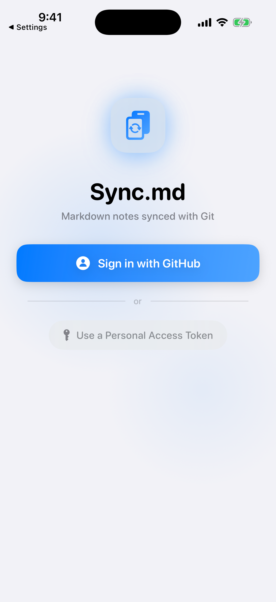

# Sync.md

**Markdown notes synced with Git** — a native iOS & iPadOS app that turns any GitHub repository into a synced markdown vault.

<p align="center">
  
  
  
</p>

## What It Does

Sync.md clones GitHub repos directly to your iPhone or iPad using [libgit2](https://libgit2.org), giving you a real `.git` directory on the device filesystem. Edit markdown files with any app — [Obsidian](https://obsidian.md), ia Writer, or the built-in Files app — then pull and push changes back to GitHub.

**Key features:**

- **Real git** — Clone, pull, commit, and push via libgit2. No REST API workarounds, no proprietary sync.
- **Multiple repos** — Manage several GitHub repositories at once.
- **Custom save locations** — Store repos anywhere accessible via the Files app.
- **Obsidian integration** — Works with Obsidian vaults via `x-callback-url` for automated sync.
- **GitHub OAuth & PAT** — Sign in with GitHub OAuth or paste a Personal Access Token.
- **Private repo support** — Works with both public and private repositories.
- **iPad support** — Optimized layouts for iPad.

## How It Works

1. **Sign in** with GitHub (OAuth or Personal Access Token)
2. **Pick a repository** from your GitHub account (or add one manually)
3. **Clone** it to your device — files appear in the iOS Files app
4. **Edit** with any markdown editor
5. **Pull** to fetch remote changes, **Push** to commit and upload yours

Files live under `On My iPhone › Sync.md` by default, or in a custom location you choose.

## Architecture

```
Sync.md/
├── Sync.md/                    # iOS app source
│   ├── Sync_mdApp.swift        # App entry point
│   ├── ContentView.swift       # Root view router
│   ├── Models/
│   │   ├── AppState.swift      # Observable app state (repos, auth, sync)
│   │   ├── RepoConfig.swift    # Repository configuration model
│   │   └── GitState.swift      # Git state persistence
│   ├── Views/
│   │   ├── SetupView.swift     # Onboarding & sign-in
│   │   ├── RepoListView.swift  # Home screen — repo cards
│   │   ├── VaultView.swift     # Single repo — pull/push/status
│   │   ├── AddRepoView.swift   # Add new repository flow
│   │   ├── RepoPickerView.swift # GitHub repo browser
│   │   ├── SettingsView.swift  # Per-repo settings
│   │   ├── GitControlSheet.swift # Commit message & push sheet
│   │   └── Theme.swift         # Design system (colors, gradients, glass cards)
│   └── Services/
│       ├── LocalGitService.swift    # libgit2 wrapper (clone/pull/push/status)
│       ├── GitHubService.swift      # GitHub REST API client
│       ├── OAuthService.swift       # GitHub OAuth via ASWebAuthenticationSession
│       ├── KeychainService.swift    # Secure token storage
│       └── CallbackURLHandler.swift # x-callback-url handler (Obsidian integration)
├── Packages/
│   └── Clibgit2/               # Swift package wrapping the libgit2 C library
├── oauth-server/               # Vercel serverless functions for GitHub OAuth
│   └── api/auth/               # Login & callback endpoints
└── libgit2.xcframework/        # Pre-built libgit2 binary for iOS
```

### Git Implementation

All git operations use **libgit2** directly via C interop — no shelling out, no REST API tree manipulation. The `LocalGitService` wraps libgit2 to provide:

- **Clone** — `git_clone` with HTTPS credential callback
- **Pull** — Fetch + fast-forward merge
- **Commit & Push** — Stage all changes, create commit, push to remote
- **Status** — Uncommitted change detection via `git_status_list`

This produces a standard `.git` directory, making repos compatible with other git tools like the [Obsidian Git](https://github.com/Vinzent03/obsidian-git) plugin.

### x-callback-url API

External apps can trigger sync operations via URL scheme:

```
syncmd://x-callback-url/<action>?repo=<folder-name>&x-success=<url>&x-error=<url>
```

| Action   | Description |
|----------|-------------|
| `pull`   | Fetch and fast-forward |
| `push`   | Stage all, commit, and push |
| `sync`   | Pull then push |
| `status` | Return branch, SHA, and change count |

## Building

### Requirements

- **Xcode 16+**
- **iOS 17.0+** deployment target
- macOS with Apple Silicon (or Intel with Rosetta)

### Steps

1. Clone the repo:
   ```bash
   git clone https://github.com/CodyBontecou/Sync.md.git
   cd Sync.md
   ```

2. Open in Xcode:
   ```bash
   open Sync.md.xcodeproj
   ```

3. Select your target device or simulator and build (`⌘B`).

The pre-built `libgit2.xcframework` is included in the repo so no additional dependency setup is needed.

### OAuth Server (Optional)

The `oauth-server/` directory contains Vercel serverless functions that handle the GitHub OAuth flow. If you want to use OAuth sign-in (instead of a PAT), you'll need to:

1. Create a [GitHub OAuth App](https://github.com/settings/developers)
2. Deploy the oauth-server to Vercel
3. Set `GITHUB_CLIENT_ID` and `GITHUB_CLIENT_SECRET` as environment variables
4. Update the `serverURL` in `OAuthService.swift`

Using a **Personal Access Token** works without any server setup — just paste a token with `repo` scope.

## Contributing

Contributions are welcome! Feel free to open issues or submit pull requests.

Some areas where help would be appreciated:

- Conflict resolution UI (currently only fast-forward merges)
- Branch switching
- Selective file staging
- Background sync / scheduled pulls
- macOS support

## License

[MIT](LICENSE) — Cody Bontecou
